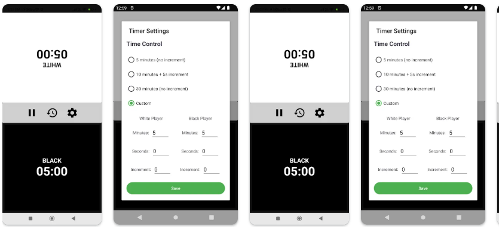

# Chess Timer App



> Professional time management for chess matches

## Table of Contents
- [Overview](#overview)
- [Features](#features)
- [Installation](#installation)
- [Usage](#usage)
- [Customization](#customization)
- [Troubleshooting](#troubleshooting)
- [Contributing](#contributing)
- [License](#license)

## Overview
A professional chess timer application for Android devices that provides accurate timekeeping for chess matches with various time control options. Perfect for tournament play, casual games, or practice sessions.

## Features

### Core Functionality
- 🕒 Dual countdown timers for White and Black players
- ⏱️ Multiple time control presets (5+0, 10+5, 30+0)
- 🛠 Custom time settings with increment/delay options
- 🔄 Automatic turn switching with tap interaction

### Game Management
- ⏸️ Pause/resume functionality
- 🔄 Reset game with one tap
- ⚙️ Adjust time during pause (arbiter mode)

### Visual & Audio Feedback
- 🟢 Active player highlight
- 🔔 Time expiration sound alert
- 🕒 Clear time display (mm:ss format)

## Installation

### Prerequisites
- Android device running Android 8.0 (Oreo) or later
- Minimum SDK version: 26

### Installation Steps
1. Download the APK file from [Releases Section](#)
2. Enable "Install from Unknown Sources" in your device settings
3. Open the downloaded APK file
4. Follow the installation prompts

*Alternatively, clone the repository and build in Android Studio:*
```bash

git clone https://github.com/ifahimkhan/chess-timer-app.git

```
## Usage

### Starting a Game
1. Open the app
2. Select time control (default: 5+0)
   - Tap "Settings" to choose presets or custom time
3. Tap White timer to begin (White moves first)

### During Gameplay
- After making a move, tap your clock to:
  - Stop your timer
  - Start opponent's timer
- The active player's timer turns green

### Game Controls
| Button   | Function                          |
|----------|-----------------------------------|
| Pause    | Temporarily stops both clocks     |
| Resume   | Continues from paused state       |
| Reset    | Starts new game with current settings |

### Game End Conditions
- A player's time reaches 0:00 (loses on time)
- Automatic sound plays when time expires
- Winner is displayed via toast message

## Customization

### Time Controls
Available presets:
- **Bullet**: 1+0, 2+1
- **Blitz**: 3+0, 5+0
- **Rapid**: 10+0, 15+10
- **Custom**: Set any time + increment

### Sound Options
- Enable/disable time expiration sound
- Volume control (follows system volume)

### Display Options
- Dark/light theme (follows system)
- Time format (mm:ss or ss only for bullet)

## Troubleshooting

### Common Issues
**Sound not working:**
- Check device volume
- Verify app has audio permissions
- Restart the app

**Timer not switching:**
- Ensure you're tapping the active player's timer
- Check for accidental pause

**App crashes:**
- Clear app cache (Settings → Apps → Chess Timer → Storage)
- Reinstall the app

## Contributing
We welcome contributions! Please follow these steps:

1. Fork the repository
2. Create your feature branch (`git checkout -b feature/AmazingFeature`)
3. Commit your changes (`git commit -m 'Add some AmazingFeature'`)
4. Push to the branch (`git push origin feature/AmazingFeature`)
5. Open a Pull Request

## License
Distributed under the MIT License. See `LICENSE` for more information.

---

*Developed with ♟️ for chess enthusiasts*  
*Last updated: 2025-05-30*
